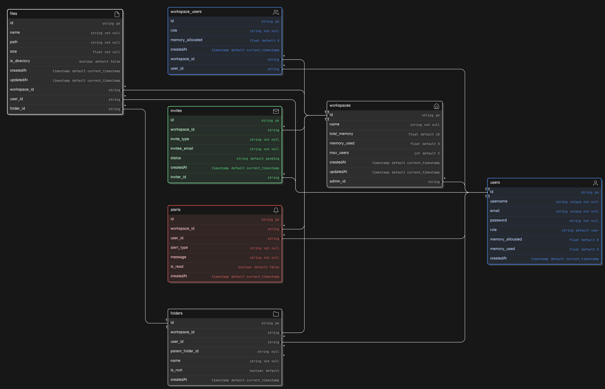

# Project Name: VaultShare
***
  
## Description:

**VaultShare** is a secure file management API service designed for collaborative workspaces. Users can create accounts and set up personalized workspaces to manage files and collaborate with other registered users. Each user can create a maximum of two workspaces and becomes the admin of any workspace they create. The workspace allows up to 5 users, including the admin, and has a total storage limit of 10 MB. VaultShare includes a permission-based file management system, where the admin can manage all user files, and users can manage their files within the workspace.

- [api-documenataion](https://github.com/DeyonOba/vault_share/blob/main/vaultshare_api_documentation.md)
- [db-documentation](https://github.com/DeyonOba/vault_share/blob/main/vaultShare/db/README.md)

## Key Features:

1. **Workspace Creation and Management:**
    - Each user can create up to 2 workspaces, with them automatically assigned the role of admin.
    - Workspaces support team roles: Admin and User. The admin invites other registered users and manages the workspace.
  
2. **User Invitation and Onboarding:**
    - Admins can invite up to 4 other users to join the workspace.
    - Invited users are notified via an alert system, and upon acceptance, a personal folder is created for them within the workspace.
    - Users can create, delete, move, rename, and share files within their folders. Admins can manage files across the entire workspace.
    
3. **File Permissions:**
    - Admins have full access to all user folders and can modify any file.
    - Users have restricted access, managing only their folders and files.

4. **Storage and User Limits:**
    - Each workspace has a total memory cap of 10 MB, which is shared among all users.
    - Admins assign and can update a memory quota for each user, with the total usage not exceeding the workspace’s limit.  

5. **Alert System:**
    - Admins receive alerts for all workspace activities: new user invitations, memory usage, and file management events.
    - Users only receive alerts concerning their own activity, such as file uploads or when nearing their memory limit.
***
## Project Set Up

- **OS: Ubuntu 22.04**
- **Python version 3.10.12**
  
Clone the repository
```bash
git clone <repo>
cd <repo_name>
```

Set up a Python virtual environment at the root and activate it.
```bash
python3 -m venv .venv
source .venv/bin/activate
```
Install required dependencies

```bash
pip install -r requirements.txt
```

## Database ERD


